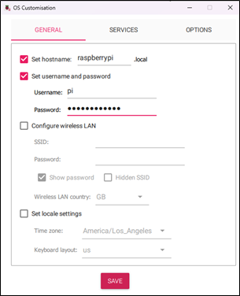
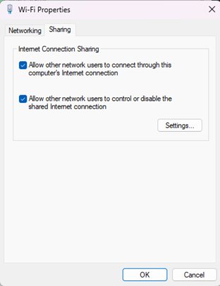
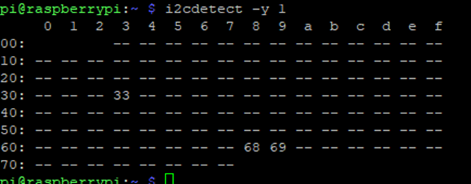

# Raspberry Pi Camera Node Setup Guide

This guide details the step-by-step OS installation, hardware interface activation 
and automated scheduling for capturing images, syncing data with Azure FileShare and power scheduling 
required to prepare field imaging nodes running on **Raspberry Pi**.

Imaging sensors: Raspberry Pi V2 RGB and NoIR, Flir Lepton thermal camera,  Melexis MLX90640 thermal camera

Note: Stereo pi pinout: https://stereopi.com/blog/synchronizing-photos-two-stereopi-boards
## Initial OS Flash

1. **OS Target:** Download and use the Raspberry Pi Imager to flash an SD card with **Raspberry Pi Bullseye** (`Raspbian GNU/Linux 11 (bullseye)`) with an **armv7l** architecture.
2. **First-Boot Customization:** Using the Raspberry Pi Imager OS Customization panel, configure the following properties:
   * **Hostname:** `raspberrypi.local`
   * **Credentials:** User `pi` with your secure network password
   * **Locale & Timezone:** `America/Los_Angeles`, Layout: `us`

   <p align="center">
     
   </p>

3. Insert this SD card to the Raspberry Pi


## Local Networking & Initial SSH Connection

To configure headless units without a standard router setup, share your development computer's active Wi-Fi connection over an Ethernet cable:

1. Connect an Ethernet cable directly from your PC's network adapter to the Raspberry Pi.
2. On Windows, navigate to **Wi-Fi Properties** -> **Sharing** tab.
3. Check **"Allow other network users to connect through this computer's Internet connection"**.
   <p align="center">
     
   </p>
4. Launch **PuTTY** or a native terminal and establish an SSH link into `pi@raspberrypi.local`.

---

## Peripheral Configuration

Execute the native configuration tool:
```bash
sudo raspi-config
```

* Navigate to interface settings and enable: **Camera, I2C, SSH, OpenGL, and SPI**.
* Commit changes and restart the system board:

```bash
sudo reboot
```

Once reconnected via SSH, initialize a virtual display container to allow remote GUI inspection:

```bash
vncserver-virtual
```

---

## Pi Cameras & Thermal Sensor Configurations

### 1. Dual Camera Array dt-blob Injection

For dual Pi-Camera configurations, copy the binary device-tree blob (`dt-blob.bin`) to the root system partition:

```bash
sudo mv /home/pi/Desktop/dt-blob.bin /boot
```

Verify pi camera sensor status across the ribbon channels:

```bash
vcgencmd get_camera
```

### 2. OpenCV Core Native Dependencies Compilation

Ensure a stable internet connection exists using ```bash curl https://linuxconfig.org```
then compile the base C++ and Python bindings required:

```bash
sudo apt-get -y install ca-certificates
sudo apt-get update
sudo apt-get install build-essential cmake pkg-config libjpeg-dev libtiff5-dev libjasper-dev libpng-dev libavcodec-dev libavformat-dev libswscale-dev libv4l-dev libxvidcore-dev libx264-dev libfontconfig1-dev libcairo2-dev libgdk-pixbuf2.0-dev libpango1.0-dev libgtk2.0-dev libgtk-3-dev libatlas-base-dev gfortran libhdf5-dev libhdf5-serial-dev libhdf5-103 python3-pyqt5 python3-dev -y
sudo apt-get install python3-opencv
```

### 3. I2C Bus Tools

Install diagnostic tools and check address locations to confirm the MLX90640 thermal sensor array is online:

```bash
sudo apt-get install -y i2c-tools
i2cdetect -y 1
```

<p align="center">
     
</p>

### 4. Configurations for MLX Thermal Sensor

```bash
sudo apt-get install libatlas-base-dev python-smbus
```

Set the default I2C clock speed from to **400kHz** by editing `config.txt`:
```bash
sudo nano /boot/config.txt
```

Modify or append the bus speed statement:
```text
dtparam=i2c_arm=on,i2c_arm_baudrate=400000
enable_uart=1
```

Reboot the device and check if the MLX thermal sensor is connected.
```bash
i2cdetect -y 1
```

### 5. Python Package Installation

Install the required libraries (Python 3.9.2).

```bash
sudo pip3 install picamera
sudo pip3 install pithermalcam --no-deps
sudo apt-get install python3-scipy
sudo pip3 install RPi.GPIO --no-deps
sudo pip3 install Adafruit-Blinka
sudo pip3 install adafruit-circuitpython-mlx90640==1.3.1
sudo pip3 install cmapy --no-deps
```

Note on NumPy compatibility: If runtime mathematical conversion issues arise, downgrade to the following version:

```bash
sudo apt remove python3-numpy
sudo apt install libatlas3-base
sudo pip3 install numpy==1.16.5

```

#### Custom collection of raw temperature matrix from MLX thermal sensor.

To expose raw array parameters, edit the pithermalcam library source files directly:

```bash
sudo nano /usr/local/lib/python3.9/dist-packages/pithermalcam/pi_therm_cam.py
```

Append the following code right below the `get_mean_temp()` declaration block to extract raw temperature matrix:

```python
def get_raw_mlx_temp_values(self):
    """Get temp of entire field of view"""
    frame = np.zeros((24*32,))  # setup array for storing all 768 temperatures
    while True:
        try:
            self.mlx.getFrame(frame)
            break
        except ValueError:
            continue
    return frame
```

To return the saved image path, add “return fname” line at the end of the `save_image()` function.

```python
def save_image(self):
    """Save the current frame as a snapshot to the output folder."""
    fname = self.output_folder + 'pic_' + dt.datetime.now().strftime('%Y-%m-%d_%H-%M-%S') + '.jpg'
    cv2.imwrite(fname, self._image)
    self._file_saved_notification_start = time.monotonic()
    print('Thermal Image ', fname)
    return fname
```

---
## Scheduling Capture Times


First permit all privileges the data and script folder:
```bash
sudo chmod -R 777 <directory>
```

To automate data captures, configure the cron:

```bash
sudo crontab -e
```

Add the following to the crontab to capture images at 10AM,1PM and 3AM.
The image capturing script can be found in [camera_run.py](camera_run.py)

```text
0 10,13,15 * * *  python3 <path_to_script>/camera_run.py >> <path_to_log_file>/camera_run_cronjob.log 2>&1
```
Logs will be saved in `<path_to_log_file>/camera_run_cronjob.log`

Enable cron logging by editing `rsyslog.conf`
```bash
sudo nano /etc/rsyslog.conf
```
And uncomment the line: `# cron.* /var/log/cron.log`
Then, restart the rsyslog service:
```bash
sudo /etc/init.d/rsyslog restart
```

## Scheduling Power (Witty Pi 3)

### 1. Install WittyPi and WiringPi

```bash
wget https://www.uugear.com/repo/WittyPi3/install.sh
sudo sh install.sh
sudo apt-get install git-core
git clone https://github.com/WiringPi/WiringPi.git
cd WiringPi
git pull origin
./build
gpio -v
```

### 2. Setup Hardware Power-State Scripts

Open the Witty Pi configurations:

```bash
cd wittypi/ && sudo ./wittyPi.sh
```
Reset the existing configurations first.
* Enter 10 then 1
* Enter 10 then 2
* Enter 6 and then 5
* Enter 11 to exit configuration

Edit `schedule.wpi` to configure the power on/off schedule.
```bash
cd wittypi/ && sudo nano schedule.wpi
```
Refer to the [power_and_cloud_upload_schedule_2024.txt](power_and_cloud_upload_schedule_2024.txt) to see the schedules for each Raspberry Pi camera setup

Ex:
```text
BEGIN   2025-03-31 09:30:00
END     2035-07-31 23:59:59
ON      M5              # keep ON state for 5  minutes for warm up (until 09:35)
OFF     M15             # keep OFF state for 15 minutes (until 09:50)
ON      M20             # keep ON state for 20 minutes (until 10:10)
OFF     H2 M40          # keep OFF state for 2 hours 40 minutes (until 12:50)
ON      M20             # keep ON state for 20 minutes (until 13:10)
OFF     H1 M40          # keep OFF state for 1 hours 40 minutes (until 14:50)
ON      M20             # keep ON state for 20 minutes (until 15:10)
OFF     H18 M20         # keep OFF state for 18 hours 40 minutes (until 09:30 next day)
```

Close and save it. Then run the schedule:
```bash
sudo ./runScript.sh
```
Make sure to check if it’s the correct date and time for the next shutdown and startup.

## Configure Network Auto-Connect Profiles

```bash
sudo nano /etc/wpa_supplicant/wpa_supplicant.conf
```

Append the mobile hotspot credentials directly to the file footer:
```text
network={
        ssid="<enter_network_name>"
        psk="<enter_password_for_the_network>"
        key_mgmt=WPA-PSK
}
```
